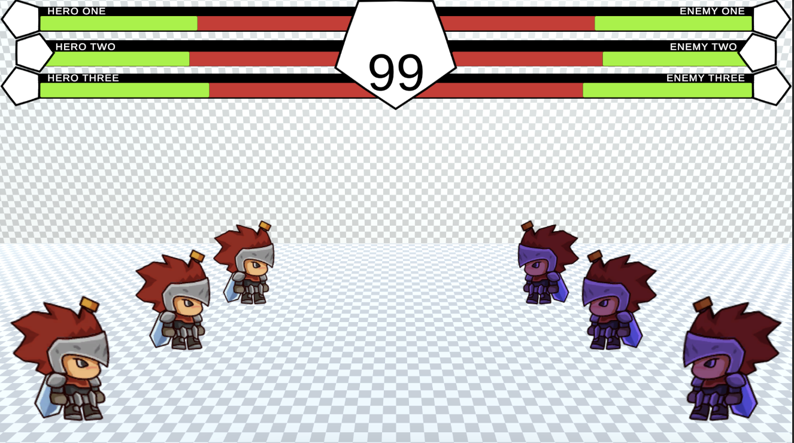

# Battle System Prototype

Ready? Fight! It's a 3 on 3 match, combining the strategy of turn-based battles with the action of fighting games.

## About This Project

My inspiration for the project came from [this article](https://www.vg247.com/street-fighter-4-producer-yoshinori-ono-once-considered-making-it-turn-based) about the producer of Street Fighter 4 mentioning that he had considered making Street Fighter 4 a turn-based fighting game.

It got me wondering how this might look and how it would feel to take the fast-paced action of fighting games and slow it down with turn-based combat. I pictured a scene with health bars and a timer at the top of the screen like a lot of fighting games have, combined with menus to select actions for your character like in a turn-based game.

An extra benefit of this combination of game genres is that the game becomes more accessible to new players or players with disabilities in that precise timing with button presses or reactions would no longer be required to perform special moves or combos.

Technology stack: Unity, C#.

### In-Game Screenshot

Taken from the game page in-browser.

## Project Status

This project is currently playable on itch.io.

To see the full game instructions and try playing it yourself, visit the game page [here](https://bdonbits.itch.io/bsp-4)

### Playtesting Feedback

After playtesting this game with 5 different people, common themes of the feedback included the following:

* Ending a turn in a dash, jump, or crouch feels too risky.
* Doing special moves with a button combo doesn't always work.
* Attacking a dashing, jumping, or crouching opponent feels like a rock-paper-scissors match while knowing your opponent's move in advance.

### Learnings

I've built 3 previous versions of this project where I focused more on the technical aspects of the game like how different types of elements or magic would interact with eachother instead of making the game feel fun to play first. With this version, I put minimal effort into the looks and removed the aspect of elements and magic to just focus on how it feels to play the game.

With the focus on game feel, I was able to quickly get more feedback and sus out what's working well and what isn't working so well. I've since determined that the next steps to try in further developing this project would include the following:

* Rework the poses to not show the opponent which pose was used to end a turn. This would create an element of luck in guessing the right type of attack to use.
* Add a cost to changing your character's pose. This would create the need to be more intentional with posing your character.
* Add a multiplayer mode. Any good fighting game needs to have the ability to battle against other people!

## How To Use

### Running the project

1. Open [Unity Hub.](https://unity.com/unity-hub)

1. Add the root folder of this repo as a project.
