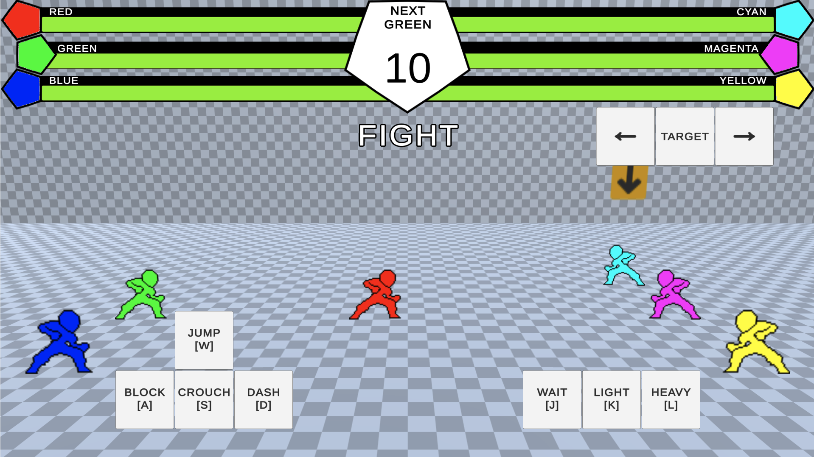

# Battle System Prototype

Square off in a 3 vs 3 battle, combining the strategy of turn-based battle systems with the action of 2D fighting games.

## About This Project

This project is a proof-of-concept to demonstrate a hybrid of turn-based battle systems and 2D fighting games.

This game works by using the on-screen buttons or the keys on your keyboard to pose your characters (RED, GREEN, and BLUE) and perform actions. The goal is to KO all opponents (CYAN, MAGENTA, and YELLOW) by reducing their health to 0.

To see the full game instructions and try playing it yourself, check out the game's page on itch.io [here](https://bdonbits.itch.io/bsp-4)

Technology stack: Unity, C#.

### In-Game Screenshot

Taken from the game page in-browser.

## Project Status

This project is in a stable, playable state and is hosted on [itch.io.](https://bdonbits.itch.io/bsp-4)

One piece of feedback that has appeared more than once is that the risk vs reward aspect of ending your turn in a jump, crouch, or dash pose doesn't seem worth it since your character is at risk for taking double damage, expecially if the opponent can see this pose ahead of time. My idea for improving upon this aspect is to not reveal this pose upon ending your turn, but to just show a generic "ready" pose that reveals itself when the opponent makes a move.

Once I have implemented and tested my idea, the next steps would be to create a title screen, set up a multiplayer mode, and have character and UI art made.

### Learnings

This is the fourth iteration of my battle system prototype and with this version in particular I have learned that continuous testing and feedback is much easier to do before focusing on any art or audio. The feedback highlights the systems and game feel instead of the art direction or effects, which is what I want to solidify before adding polish.

## How To Use

### Running the project

1. Open [Unity Hub.](https://unity.com/unity-hub)

1. Add the root folder of this repo as a project.